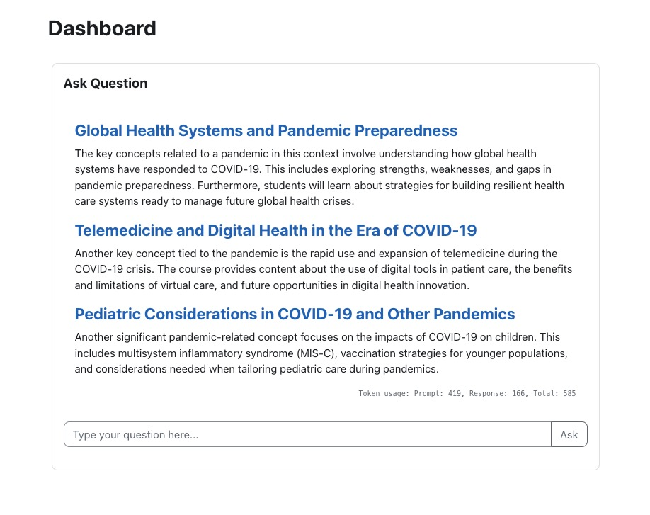
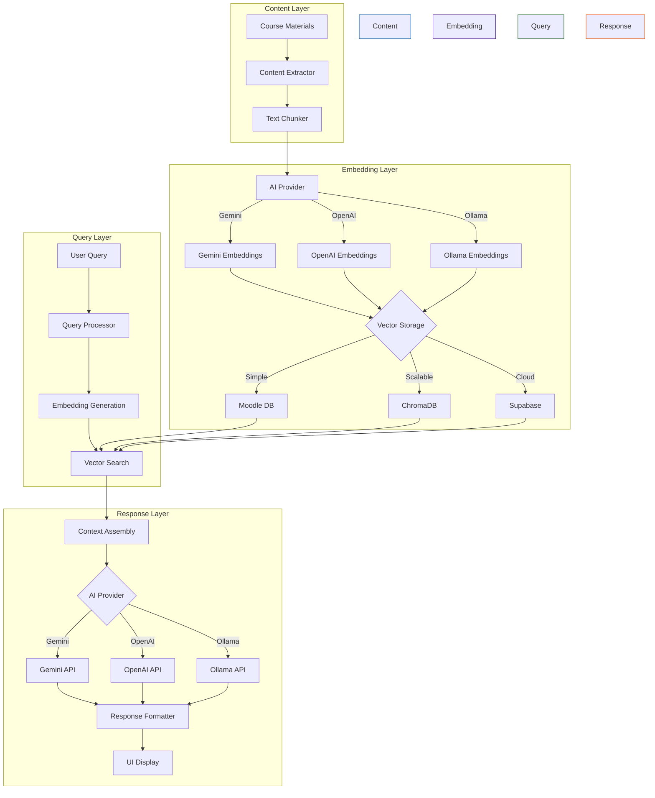

[](https://github.com/khairu-aqsara/terusrag/actions/workflows/main.yml)
# Terus Rag Block for Moodle



## Overview
This Moodle block plugin implements Retrieval-Augmented Generation (RAG) functionality, allowing users to query course content using large language models. The plugin integrates with either Google's Gemini API, Ollama or OpenAI to provide intelligent responses based on your course data.

### Searchable Content
For now the plugin indexes and makes searchable the Course descriptions and summaries

The content is automatically processed and indexed during the daily scheduled task, with immediate indexing occurring when content is created or modified.

## Features
- Implements RAG (Retrieval-Augmented Generation) architecture
- Integrates with Google's Gemini API, OpenAI, and Ollama
- Supports vector embeddings for semantic search
- Uses hybrid ranking with BM25 and cosine similarity
- Automatically processes and indexes course content
- Proper capability management for adding block instances

## Vector Database Feature Implementation

- [x] Moodle Database
- [ ] ChromaDB
- [ ] Supabase

## Ai Provider Feature Implementation 
- [x] Gemini
- [x] OpenAI
- [x] Ollama
- [ ] Anthropic


## How It Works



## AI Providers

This plugin supports three AI providers for handling RAG operations:

1. Google Gemini (Default)
   - Uses Gemini 2.0 Flash for chat completions
   - Supports text-embedding-004 for vector embeddings
   - Direct integration with Google AI Studio
   - Optimized for performance and cost-effectiveness

2. OpenAI
   - Supports GPT-4 and GPT-3.5 models
   - Multiple embedding model options:
     * text-embedding-3-large
     * text-embedding-3-small
     * text-embedding-ada-002
   - Flexible API endpoint configuration
   - Enterprise-grade capabilities

3. Ollama
   - Supports multiple open-source models
   - Available embedding models:
     * nomic-embed-text
     * all-minilm (33M and 22M variants)
   - Local deployment option
   - Cost-effective solution

## Installation
1. Copy the terusrag folder into your Moodle blocks directory
2. Visit the notifications page (Site administration → Notifications) to complete the installation
3. Configure the API keys in the block settings
4. Add the block to your course or Dashboard

## Requirements
- Moodle 4.1.3 or later
- PHP 7.4 or later
- Access to one of:
  * Gemini API (default provider)
  * OpenAI API
  * Ollama API (local or remote instance)

## Configuration
1. Go to Site Administration → Plugins → Blocks → Terus RAG
2. Choose your preferred AI provider (Gemini, OpenAI, or Ollama)
3. For Gemini:
   - Obtain API key from Google AI Studio
   - Configure Gemini endpoint and model settings
4. For OpenAI:
   - Obtain API key from OpenAI platform
   - Configure OpenAI endpoint and model preferences
5. For Ollama:
   - Set up Ollama instance (local or remote)
   - Configure Ollama endpoint and selected models
   - Specify embedding model preferences
6. Save changes and initialize the data process

## Scheduled Tasks
The plugin includes scheduled tasks to maintain and update the vector embeddings of course content:

1. Content Indexing Task
   - Runs daily by default
   - Scans course content for changes
   - Processes course content which includes:
     * Course descriptions and summaries
     * Course section descriptions
     * Resource descriptions and content
     * Activity descriptions and content (assignments, quizzes, forums, etc.)
     * Book and page module content
     * Labels and HTML blocks content
   - Updates vector embeddings for modified content
   - Re-indexes content when course information changes

2. Running Tasks Manually
   - Via CLI:
     ```bash
     # List all tasks
     php admin/cli/scheduled_task.php --list

     # Run content indexing task
     php admin/cli/scheduled_task.php --execute=\\block_terusrag\\task\\datainitializer
     ```

## Core Files
- **provider_interface.php**: Interface defining LLM provider capabilities
- **gemini.php**: Implementation of the Gemini API integration
- **openai.php**: Implementation of the OpenAI API integration
- **bm25.php**: BM25 ranking algorithm for text retrieval
- **llm.php**: Helper class with vector operations for LLM processing

## Prompt Optimization

The plugin includes intelligent prompt optimization techniques to improve the quality of responses:

1. **Key Term Emphasis**: Automatically identifies and emphasizes important terms in user queries
2. **Entity Recognition**: Identifies proper nouns and technical terms to provide better context
3. **Redundancy Removal**: Eliminates unnecessary phrases that can dilute query effectiveness
4. **Context Enhancement**: Adds relevant context when queries lack sufficient specificity
5. **Density Analysis**: Calculates content-to-filler ratio to improve query precision

When enabled, this optimization process happens automatically when users submit queries, resulting in:
- More accurate responses
- Better focus on technical content
- Reduced token consumption
- Improved response consistency

## Capabilities
- block/terusrag:addinstance - Controls who can add the block to a course
- block/terusrag:myaddinstance - Controls who can add the block to their Dashboard

## Author
- Name: Khairu Aqsara
- Email: khairu@teruselearning.co.uk
- Website: https://teruselearning.co.uk


## License
This program is free software: you can redistribute it and/or modify it under the terms of the GNU General Public License as published by the Free Software Foundation, either version 3 of the License, or (at your option) any later version.
# plugin_rag
